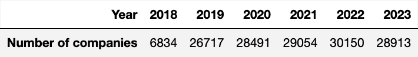
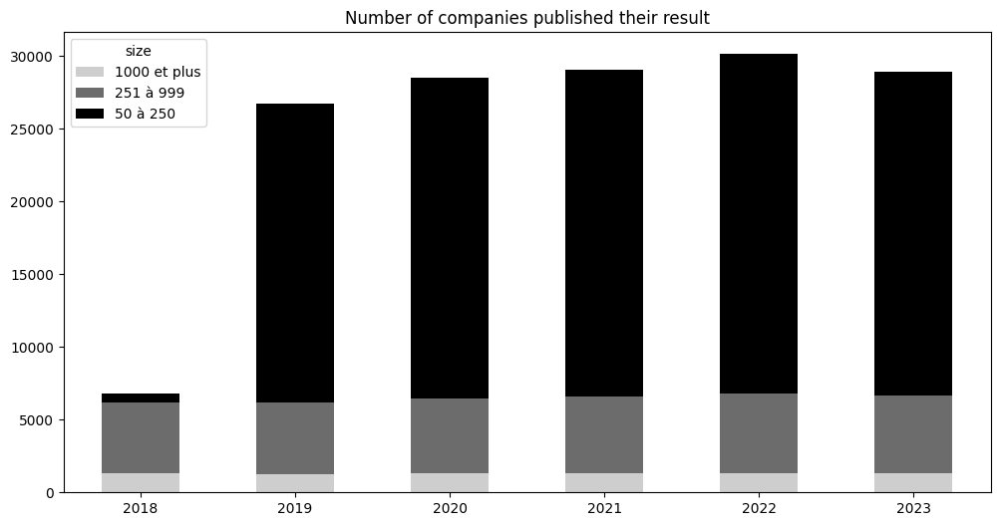
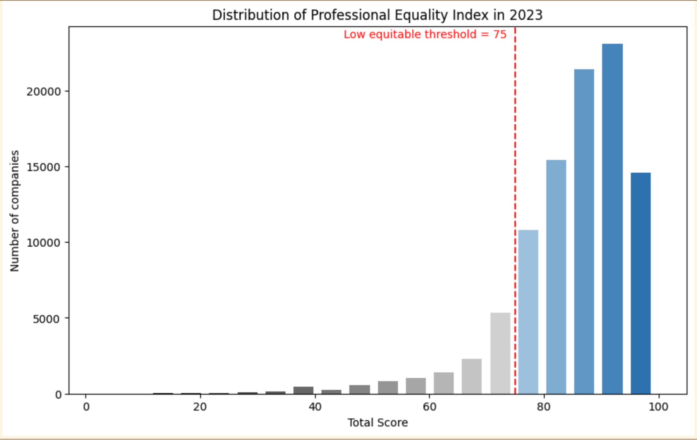
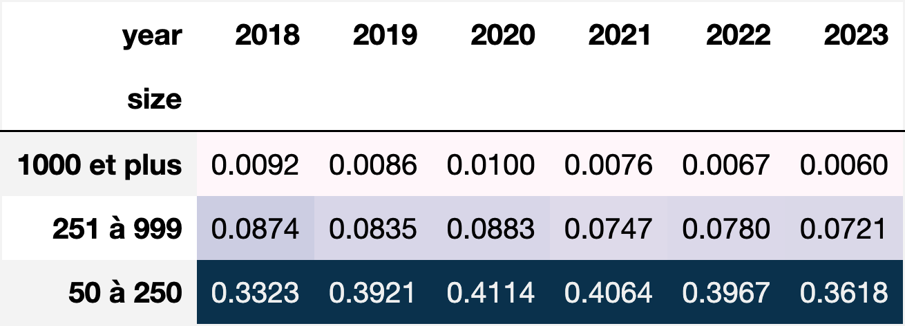
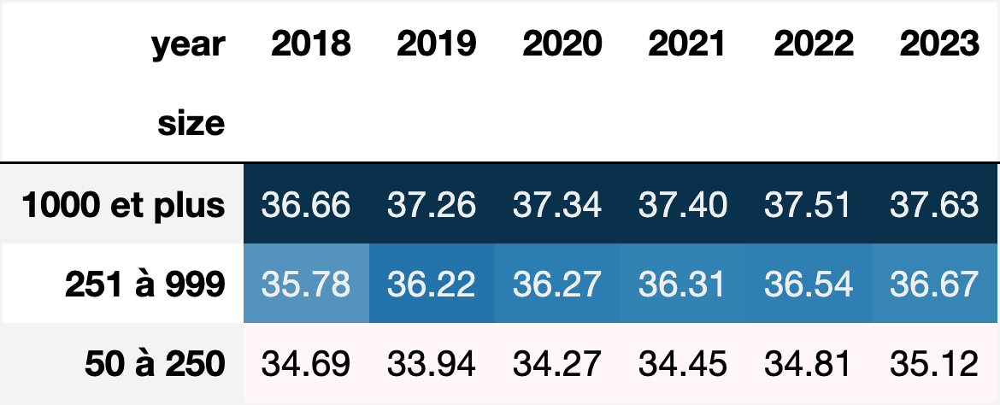
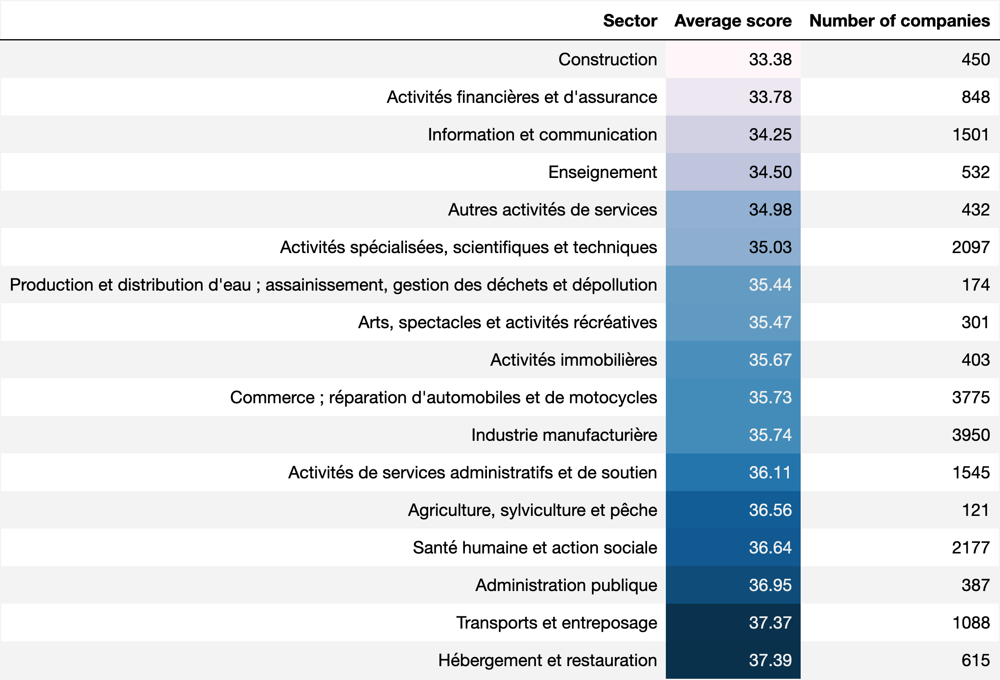
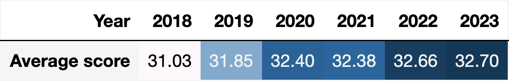
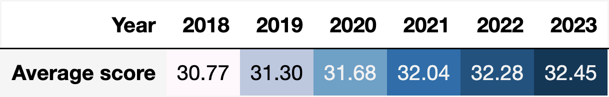
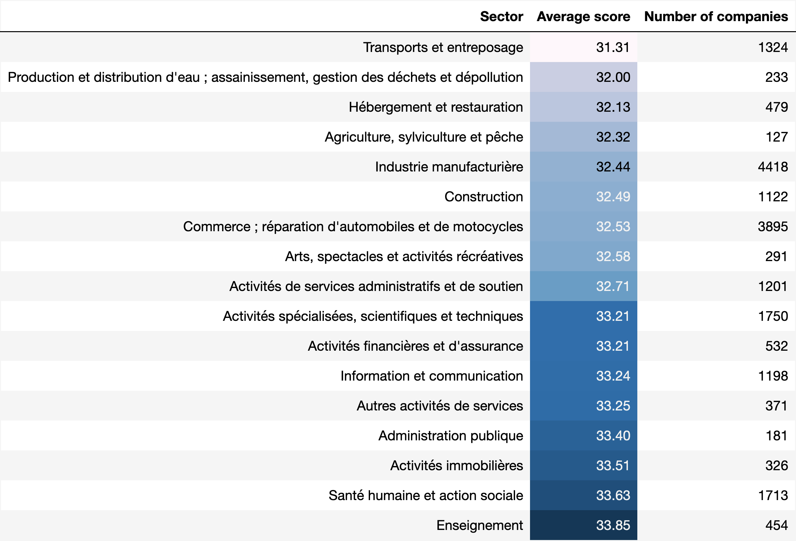
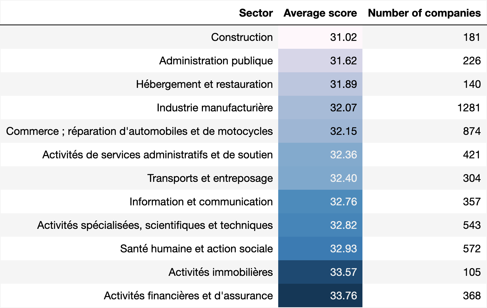

## Gender equality dataset analysis

### Introduction

Introduced in 2019, the Professional Equality Index ("Index de l'égalité Professionel" in French) is a measure of gender inequality in the workplace. When launched in March 2019, the index was mandatory for companies with more than 1,000 employees. It was then expanded to companies with 250 to 1,000 employees in September of the same year. In March 2020, all companies with 50 or more employees were obliged to publish this index annually, no later than March 1.

This index is calculated based on the following components:

- The gender pay gap
- Salary raises and promotions distribution gap
- Percentage of employees having a salary raise when returning from maternity leave.
- Parity among the 10 highest salaries.

In this article, we analyze the Professional Equality Index dataset, available for the public on [French government website](https://www.data.gouv.fr/fr/datasets/index-egalite-professionnelle-f-h-des-entreprises-de-50-salaries-ou-plus/).

At the time of analysis, the data for 2023 is still not stable. If you download the dataset and run the code, you can find a slightly different result.

### Pre-requisite - Employees taken into account in the calculation

It is important to note that **not all employees are taken into account in the calculation**. In fact, the following employees are excluded:

- apprentices and professionalization contracts
- employees made available to the company by an external company (including temporary workers)
- expatriates
- pre-retirement employees
- employees absent for more than 6 months during the reference period (sick leave, unpaid leave, fixed-term contract <6 months, etc.).

### Dataset Overview

```python
import pandas as pd
pd.options.display.max_rows = None
df = pd.read_excel('index-egalite-fh.xlsx')
print(df.shape)
print(df.columns)
```

```
(150159, 18)
Index(['Année', 'Structure', 'Tranche d'effectifs', 'SIREN', 'Raison Sociale',
       'Nom UES', 'Entreprises UES (SIREN)', 'Région', 'Département', 'Pays',
       'Code NAF', 'Note Ecart rémunération',
       'Note Ecart taux d'augmentation (hors promotion)',
       'Note Ecart taux de promotion', 'Note Ecart taux d'augmentation',
       'Note Retour congé maternité', 'Note Hautes rémunérations',
       'Note Index'],
      dtype='object')
```

The dataset contains **150159 rows and 18 columns**. There are 3 types of information:

- Company identification columns: Raison Sociale, Nom UES, SIREN, Entreprises UES (SIREN)
- Categorical columns: Année, Structure, Région, Département, Pays, Code NAF
- Measure columns: Note Ecart rémunération, Note Ecart taux d'augmentation (hors promotion), Note Ecart taux de promotion, Note Ecart taux d'augmentation, Note Retour congé maternité, Note Hautes rémunérations, Note Index

We removed unnecessary columns and renamed some columns.

```python
df_cleaned = df.drop(columns=['Raison Sociale', 'SIREN', 'Nom UES', 'Entreprises UES (SIREN)'], axis=1)

df_cleaned.rename(columns={
    "Année": "year",
    "Structure": "structure",
    "Tranche d'effectifs": "size",
    "Région": "region",
    "Département": "department",
    "Pays": "country",
    "Code NAF": "naf_code",
    "Note Ecart rémunération": "pay_gap_score",
    "Note Ecart taux d'augmentation (hors promotion)": "augmentation_excluding_promotion_gap_score",
    "Note Ecart taux de promotion": "promotion_gap_score",
    "Note Ecart taux d'augmentation": "augmentation_gap_score",
    "Note Retour congé maternité": "maternity_return_score",
    "Note Hautes rémunérations": "high_wages_score",
    "Note Index": "global_score",
}, inplace=True)
```

The column `naf_code` contains the company activity code and the name, we only need the first information.

```python
df_cleaned['naf_code'] = df_cleaned['naf_code'].apply(lambda x: x.split(' - ')[0] if x else None)
print(df_cleaned.isnull().sum())
```

```
year                                               0
structure                                          0
size                                               0
region                                           462
department                                       462
country                                            0
naf_code                                           0
pay_gap_score                                      0
augmentation_excluding_promotion_gap_score    111277
promotion_gap_score                           111277
augmentation_gap_score                         38882
maternity_return_score                             0
high_wages_score                                   0
global_score                                       0
dtype: int64
```

The dataset is quite **complete**. `augmentation_excluding_promotion_gap_score` and `promotion_gap_score` are only available for companies with more than 1000 employees. While `augmentation_gap_score` is only available for companies with 250 to 1000 employees. `Region` and `department` columns have `null` values, we'll handle that when needed.

### Number of companies publish their result

```python
import dataframe_image as dfi
year_counts = df_cleaned['year'].value_counts().reset_index().sort_values('year')
year_counts.columns = ['Year', 'Number of companies']
year_counts = year_counts.set_index('Year').transpose()
dfi.export(year_counts, 'year_counts.png', dpi=150)
```



The expansion of the index in September 2019 and March 2020 explains the huge increment in the number of companies that published their score for 2019.
This phenomenon is more visible when we group companies by `size`.

```python
df_cleaned.groupby(['year', 'size']).size().unstack().plot.bar(stacked=True, rot=0, figsize=(12, 6), colormap=grey_cmap)
```



An emerging question is whether all companies with more than 50 employees fulfill their obligations. We need to know how many companies have more than 50 salaries to respond to that question. Unfortunately, we don't have the exact number so we'll try to find an acceptable approximate.

On this [site](https://www.sirene.fr/sirene/public/creation-fichier), we can filter establishments by their size. Note that:

- About half of establishments don't provide the number of employees. These are mainly recent establishments.
- A company can have many establishments.

We will try to compute the **minimum** number of companies with more than 50 employees. We filter establishments with at least 10 employees and download the file. We assume that the number of employees in a range is the minimum value. We group establishments by `siren` to find the number of employees of a company.

```python
df_establishments = pd.read_csv('etablissements.csv')
nb_big_companies = df_establishments[
    (df_establishments['trancheEffectifsEtablissement'] != 11) &
    (df_establishments['trancheEffectifsEtablissement'] != 12)
]['siren'].nunique()
print(nb_big_companies)
df_small_establishments = df_establishments[
    (df_establishments['trancheEffectifsEtablissement'] == 11) |
    (df_establishments['trancheEffectifsEtablissement'] == 12)
]
df_small_establishments['approxEmployees'] = df_small_establishments['trancheEffectifsEtablissement'].apply(lambda x: 10 if x == 11 else 20)
df_small_companies = df_small_establishments.groupby('siren').agg(approxEmployees = ('approxEmployees' , 'sum')).reset_index()
nb_companies_having_more_than_50_emp = len(df_small_companies[df_small_companies['approxEmployees'] >= 50]) + nb_big_companies
print(nb_companies_having_more_than_50_emp)
```

We have about `54896` at least companies with more than 50 employees. That means about **52,67%** companies publish their Professional Equality Index for 2023. However, it's already 2 months past the deadline as the time of analyzing.

### Global score

The global score is aggregated based on the component indicators.

| Indicators                                                                            | Maximum score |
| ------------------------------------------------------------------------------------- | ------------- |
| Gender pay gap                                                                        | 40/100        |
| Salary raises including promotion distribution gap (for companies <= 250 employees)   | 35/100        |
| Salary raises excluding promotion distribution gap (for companies > 250 employees)    | 20/100        |
| Promotion distribution gap (for companies > 250 employees)                            | 15/100        |
| Percentage of employees having a salary raise after their return from maternity leave | 15/100        |
| Parity among the 10 highest salaries                                                  | 10/100        |

Note that, in some conditions, calculating some indicators is **impossible**. In this case, the indicator is marked as `NC` in the dataset. The global score is only calculable if the calculable indicators represent at least 75 points. In other words, if the companies cannot compute either `Gender pay gap` or `Salary raises & promotion distribution gap` indicator, they cannot have the global score.

When all the indicators have values, the global score is the sum. Otherwise, it is calculated as a prorate out of 100.

Example:

| Indicator 1 | Indicator 2 | Indicator 3 | Indicator 4 | Indicator 5 | Indicator 6 | Global score  |
| ----------- | ----------- | ----------- | ----------- | ----------- | ----------- | ------------- |
| 35          | 30          |             |             | 15          | 10          | 90            |
| 35          | NC          |             |             | 15          | 10          | NC            |
| 35          | 30          |             |             | NC          | 10          | 75/85\*100=88 |

A note below 75 is considered a notable inequality. The company has 3 years to improve the situation. We categorize companies into 3 groups: `To improve` (note < 75), `Equitable` (note >= 75), and `Insufficient data` (note = NC). The following graph illustrates the evolution of 3 groups in the period 2018 - 2023.


The number of companies in inequitable conditions reduced constantly but slowly. In contrast, the number of companies in good condition increased. However, there is a non-negligible number of companies that don't have enough data to compute the global score. We'll explain this case when diving into the 2 most important indicators: `Gender pay gap` and `Salary raises & promotion distribution gap` in the following sections.

In terms of distribution, here's how companies' scores are distributed for 2023.



### Gender pay gap indicator

In this section, we analyze the gender pay gap indicator. With the highest score of 40, it is the most important contributor to the final result.

In this indicator, **not all type of compensation is taken into account**. The following types are included:

- Ordinary wages and all other benefits as a result of the staff's employment
- Commission, bonuses linked to individual performance
- Collective bonuses (transport bonuses, vacation bonuses)
- Paid vacation pay

In contrast, the following kinds of compensation are excluded in this indicator:

- end of fixed-term contract compensation
- the sums paid in case of time savings account (CET), shares, stock options, deferred compensation in shares
- bonuses linked to a particular subject: cold bonus, night bonus...
- overtime and complementary bonus
- severance pay, retirement benefits
- seniority bonuses, profit-sharing and participation bonuses

To compute this indicator, company staff are divided into different groups. There are 2 grouping methods:

- By social-professional category and age: staff are divided into 4 categories that are `workers`, `employees`, `technicians and supervisors`, `engineers and executives`. Inside each categories, they are grouped by age range: `<30`, `30-39`, `40-49`, and `>50`.
- By level or hierarchical coefficient and age

Only groups with **at least 3 men and 3 women** (\*) are taken into account. The difference in terms of wage is computed as:
$$diff_group = (sum_salary_men - sum_salary_women) / sum_salary_men$$

This number is adjusted by a "perfect threshold" of **5%** if the company uses the first grouping method. Otherwise, the number is adjusted by **2%**. The value across groups is the **weighted average** of group values, in absolute, rounded to the first decimal place.

**A condition that is not easy to fulfill for small companies**

The following table represents the ratio of companies having non-calculable pay gap scores. Small companies with employees distributed evenly across groups might not have any groups satisfy the condition (\*), resulting in a non-calculable indicator and thus a non-calculable global score.



**About the calculation**

Based on the calculating method, we can see that the indicator is heavily impacted by the most popular group in a company and can possibly hide the inequalities in smaller groups.

The following table represents the average pay gap score for each company size. We can see that the average note of big corporations is always higher than the one of smaller companies.


The 4th indicator `Parity among the 10 highest salaries` also involves wage equality. The correlation between these 2 indicators is only **0.12**, which indicates a **very weak relation** between them.

Based on the two data above, we can **hypothesize** that this index is strongly influenced by the group of low-paid employees in the company. Therefore, it is independent of the fourth index related to the 10 highest-paid employees. This group of employees has a smaller salary gap than groups of employees with higher salaries. If we use the pyramid model, the proportion of low-paid staff in large companies is overwhelming, leading to a higher index in large corporations than in small companies.

**Ranked pay gap score by sector**

Using the column `naf_code` that represents the company's activity code, we can join the dataset with the activity hierarchical dataset [here](https://www.insee.fr/fr/information/2408180). Then, we can group companies and rank the pay gap score by sector.

The following table shows the average pay gap score by sector for 2023. It's worth noting that the highest salary disparities occur in industries with high levels of cognitive demand such as Financial and insurance activities, Information and Communication, Education, and Scientific and technical activities.

.

### Salary raises and promotions distribution gap

In this section, we analyze the differences in the distribution of salary raises and promotions. This indicator is the second most important contributor to the final result with the highest note of 35.

This aspect is calculated differently based on the company size. For smaller businesses, promotion and salary raises are considered together. While for a company with over 250 staff, these 2 aspects are treated separately.

For companies with 50 to 250 staff, the indicator `Salary raises including promotion distribution gap` is calculable if 2 below conditions are met:
- At least 1 augmentation occurred in the period
- The employees' group considered has at least 5 men and 5 women

The augmentation gap is computed as the difference between the percentage of men has augmentation and that of women. Then, this number is multiplied by the number of employees in the smaller group (the gap in employee unit). The note is assessed on the 2 previous numbers, using the scale in [this section](https://egapro.travail.gouv.fr/aide-simulation#comment-est-calcul-l-indicateur-2-50-250) and the highest note is the final result.

For large corporations, salary raises and promotion gap indicators are computed by the social-professional group, then the company-level value is the weighted average of each group's values. The condition is:
- Each group has at least 10 men and 10 women
- The employee's group represents at least 40% of the total company staff

For all indicators in this group, if the result is favored for the less well-paid gender: the maximum score is attributed to the company considering the latter tries to reduce gender inequality.

**A more popular indicator**

The following table illustrates the ratio of companies that don't dispose of sufficient data to compute the augmentation distribution gap score. The condition is harder to meet for smaller companies. However, it is much more reachable than the first indicator where we already saw 3 times higher ratios.


**The situation is improved globally**

The 2 following tables show the average augmentation distribution gap score. The steady increase in scores over the years indicates that the situation is gradually improving. 
.
.

**Ranked augmentation distribution gap score by sector**

Joining the data with the activity hierarchical dataset as shown in the previous section, we have the ranking of the augmentation distribution gap score.

The 2 following tables show the average augmentation distribution gap score by sector for 2023. Industries with low pay gap scores like Scientific and technical activities, Financial and insurance activities, Information and Communication, and Education have good scores this time. This indicates that efforts are being made to reduce gender inequality in these industries. In contrast, the Accommodation and restoration industry, which has the smallest pay gap between men and women, exhibits an inequality in salary raises and promotion. Most notably, the construction industry has low scores in both of these important criteria.

.
.

### Conclusion
In this article, we examined the Gender Equality Index dataset. Through data analysis and visualization, we have a better understanding of the gender equality index at work as well as its two main components: the salary gap index and the augmentation distribution gap index. Through this analysis, we have seen that there are still many companies with more than 50 employees that do not publish the index, even though this is required. The way the pay gap index is calculated makes it impossible for many companies to calculate it, leading to the overall index being incalculable. Additionally, this index also can potentially hide inequality among minority groups within the company. The positive point is that the general index and its two key components are improving year after year. Finally, data aggregation always comes with a loss of detail. Gender balance at work is a complex aspect that is difficult to cover with one number fully. There we should delve deeper into the facts instead of drawing conclusions based on a single figure.

### Reference

- https://egapro.travail.gouv.fr/aide-simulation
- https://travail-emploi.gouv.fr/droit-du-travail/egalite-professionnelle-discrimination-et-harcelement/indexegapro
