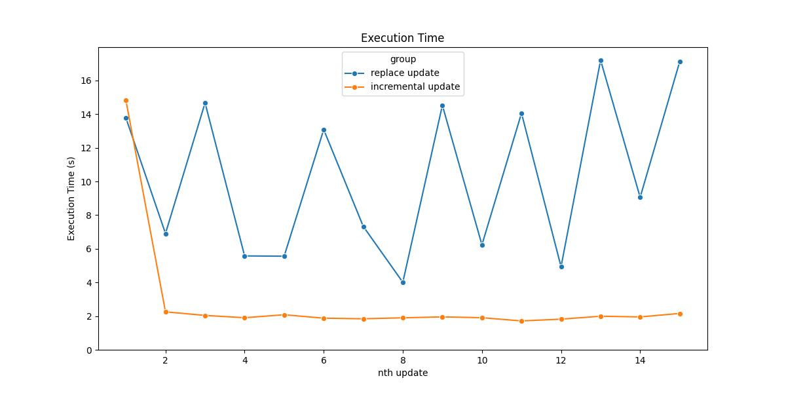
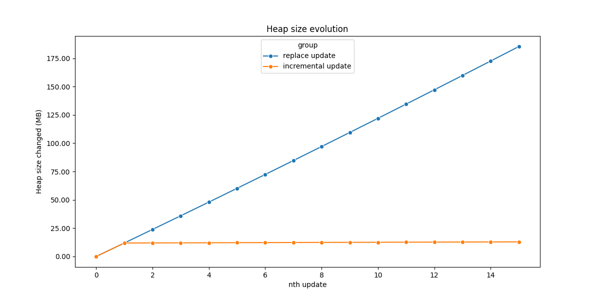
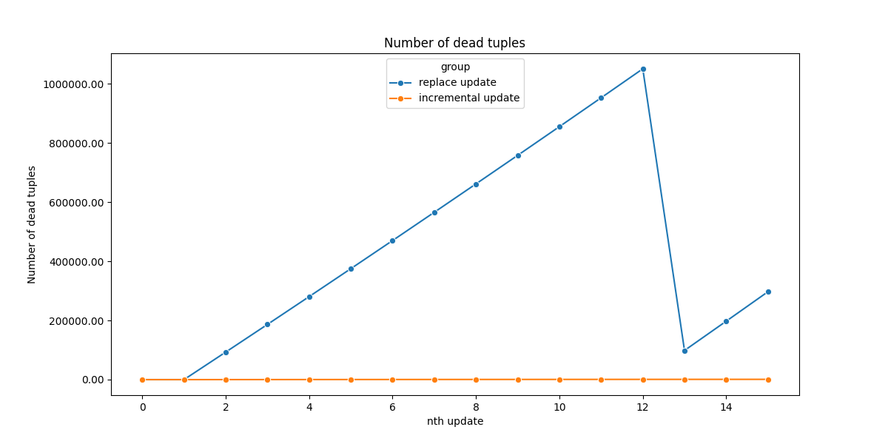
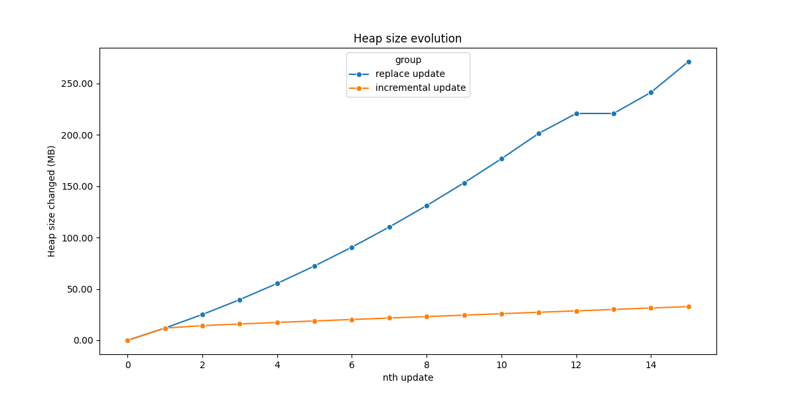
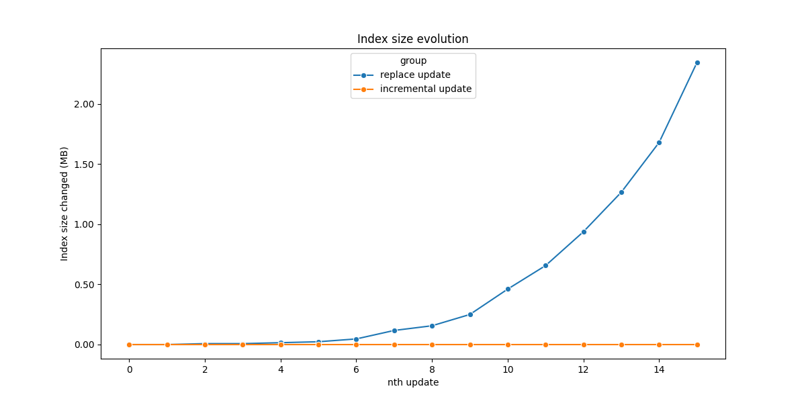
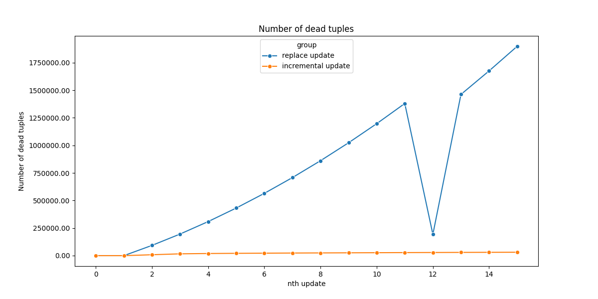
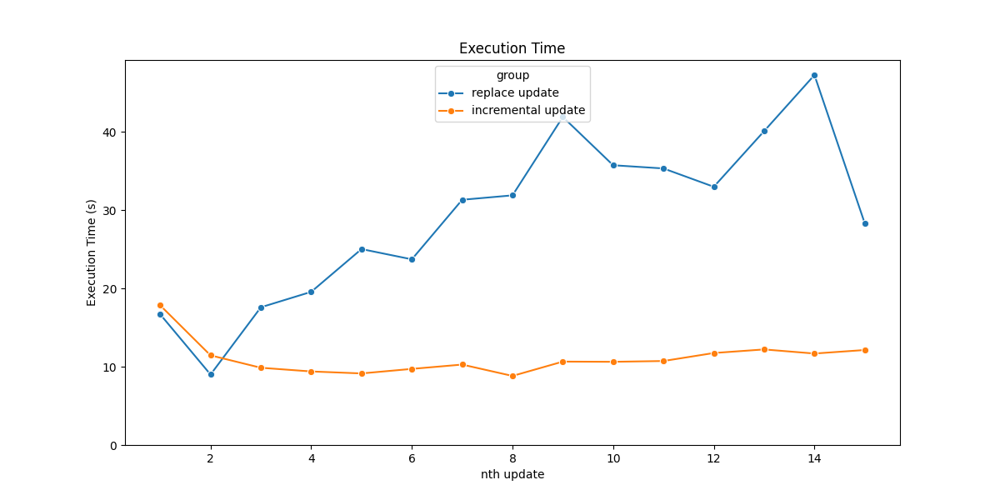
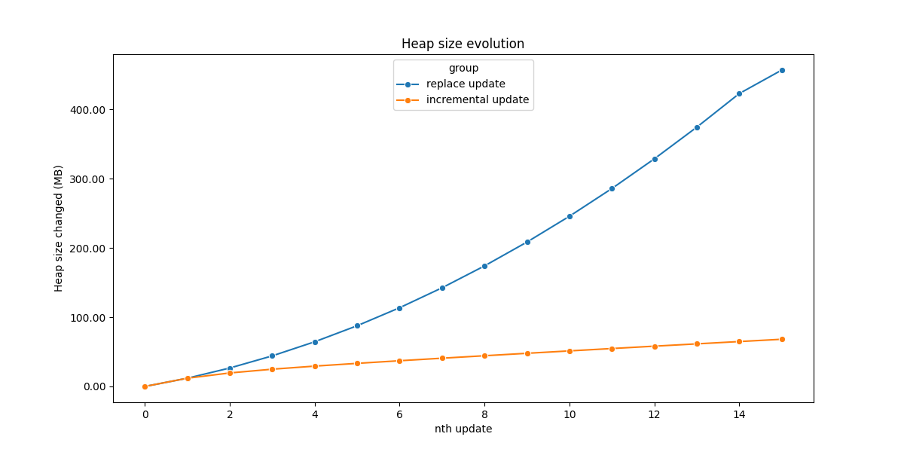
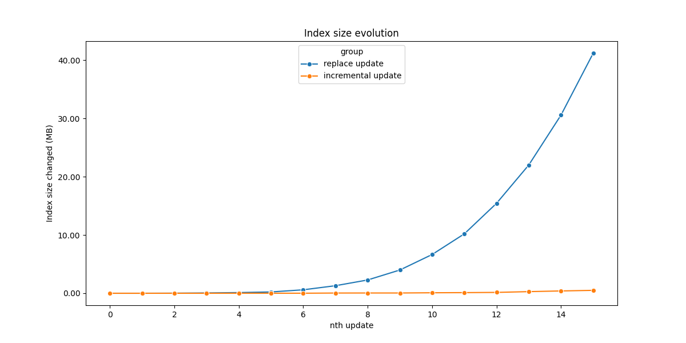
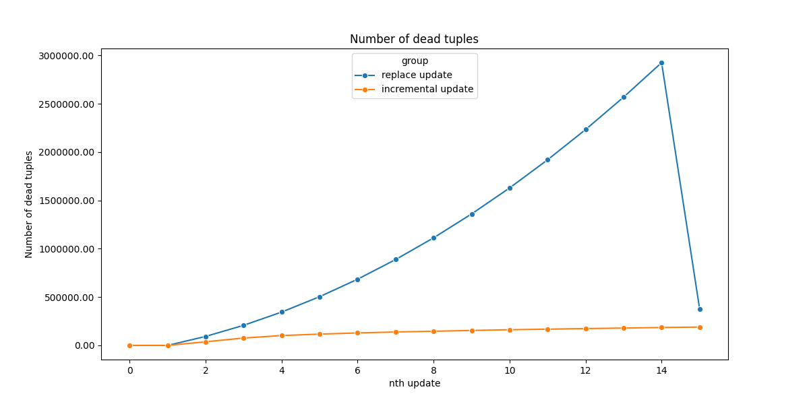

# Using differential update to speedup execution time and reduce disk consumption 
## Problem
A supermarket chain use Postgres database to store their data. In the database, we store orders information in the table named `Order`. Each row represents an order with the following fields:
- `market_id`: The id of market where the order is placed
- `order_id`: The order id
- `date`: The date when the order is placed
- `total_price`: The total price of order
- `number_items`: The number of items in the order

Each day, every supermarkets in the chain send their data of the current month to the system in CSV format. Each file contains orders of 1 market of the current month.

To update data, we delete rows by `market_id`, load the file into a temporary table before inserting them into the permanent table. This procedure, while being safe, creates a lot of dead tuples in both heap space and index space. The size of index increase permanently. In order to keep the table in good shape, we have to:
- Running VACUUM command periodically to reclaim disk space occupied by dead rows.
- Running REINDEX command periodically to save the index from bloating.
 
Keep in mind that, running these commands on a large table is a resource-consuming task. In addition, VACUUM command does not reduce the disk space so you might be charged more than what you actually use (aka money wasted!).

We want an efficient way to update data in `Order` table.

## Method
We identify the different between data in the CSV file and those currently in the table `Order`. Then, we update the data accordingly. Concretely, instead of deleting all data of a market then reinserting them, we need to:
- Insert new orders
- Update existing orders that have been modified in the CSV file
- Delete the orders currently in the table but not in the CSV file

### Define the notion of *difference*
In this example, we consider the total price and number items of the order can be modified. In contrast, `order_id`, `market_id` and `date` are static.

### Create the fingerprint
To know if an order has been modified between 2 load, we compute the fingerprint of the order. fingerprint contains all the field that can be changed. By comparing the fingerprint of the same `order_id`, we know if it has been modified or not.

### Identify changes to made
Given 2 table: 
- **compare_orders**: the subset of the permanent table, containing current orders in the database for a month.
- **tmp_orders**: the temporary table containing data read from csv file.
 
We can identify new orders to update, changed order to modified and obsolete order to delete like following

#### New orders
These are rows in `tmp_orders` table where `id` does not exist in `compare_orders` table.

#### Updated orders
These are rows in `tmp_orders` table where `id` exist in `compare_orders` table but the fingerprint value in 2 tables are different.

We can handle new and updated orders in 1 single UPSERT command:
```sql
INSERT INTO orders 
SELECT tmp.market_id, tmp.order_id, tmp.date, tmp.total_price, tmp.nb_items FROM tmp_orders tmp 
LEFT JOIN compare_orders comp 
ON tmp.order_id = comp.order_id
WHERE comp.order_id IS NULL 
OR tmp.fingerprint != comp.fingerprint
ON CONFLICT (order_id) DO UPDATE
SET total_price = EXCLUDED.total_price, nb_items = EXCLUDED.nb_items;
```

#### Deleted orders
These are rows in `compare_orders` table where `id` does not exist in `tmp_orders` table.
```sql
    DELETE FROM orders WHERE order_id IN (
    SELECT comp.order_id order_id FROM compare_orders comp
    LEFT JOIN tmp_orders tmp
    ON comp.order_id = tmp.order_id
    WHERE tmp.order_id IS NULL
)
```

## Experimentation
We benchmark 2 update methods in 3 scenarios:
- Scenario 1: The data differs only slightly between versions
- Scenario 2: The data is quite different between versions
- Scenario 3: The data is very different between versions

### Generate data
#### Data in the table
In the experimentation, we generated data for 10 markets from 01/01/2023 to 31/12/2023. Each market has 3000 orders per day.

The number of rows in the table `orders` is: 3000 * 365 * 10 = 10 9500 00 rows

#### CSV files
For each scenario, we generated 15 versions. The first version contains 3000 orders per day from 01/01/2024 to 31/01/2024.

Then, we modify this version base on the scenario:
- Scenario 1: For each version, we add 500 new orders and modify 90 orders. The diff ratio is: (500 + 90) / 93000 ~~ 0.006
- Scenario 2: For each version, we add 10000 new orders and modify 8600 orders. The diff ratio is: (10000 + 8600) / 93000 = 0.2
- Scenario 3: For each version, we add 22000 new orders and modify 47750 orders. The diff ratio is:  (22000 + 47750) / 93000 = 0.75

### Benchmark update methods
#### Metrics used in the benchmark
To compare the performance of 2 methods, we use the following metrics:
- **execution time**: Time to update the data. Lower is better.
- **heap size change**: The accumulated difference of heap size before and after the update. Lower is better.
- **index size change**: The accumulated difference of index size before and after the update. Lower is better.
- **dead rows change**: The accumulated difference of dead rows before and after the update. Lower is better.

The first metric can be obtained by record the timestamp before and after calling the method. Other metrics are available in the table `pg_stat_user_tables`.

#### Steps
- First, we clone the original table `orders` to a new table `orders_{method}`.
- We load data to the temporary table
- We record the metrics mentioned above before calling the update method
- We call the update method
- We record the metrics and compute the difference before and after.
- The result is exported to csv file to create charts.
  
### Result
#### Scenario 1 - The data differs only slightly between versions





#### Scenario 2: The data is quite different between versions






#### Scenario 3: The data is very different between versions







In all scenarios, the incremental update method prove its efficiency in all metrics:
- This method update data faster than the update-by-replace method in most attempts, except the first one.
  - For the first update, the fingerprint calculation added overhead while the only thing to do is to add all data in the temporary table into the final table.

- Heap size, index size and number of dead rows increase slower than in the update-by-replace method.
  - When using the incremental update method, these 3 metrics increased steadily. When using update-by-replace method, the heap size increased linearly and the index size increased even faster.
  - Because the number of inserted and deleted rows are lower, the incremental update method triggers VACUUM later than the update-by-replace method.

The incremental update method, as is implemented in this example, is the most basic version to demonstrate the concept. We can improve it further to archive better performance. For example, after loading data into the final table, we can export the data with fingerprint column to a file. In the next update, we can read data from that file and skip the fingerprint computation step.

## Conclusion
In this article, we presented to you the problem of updating data in batch in Postgres. We discussed and benchmarked 2 methods: update-by-replace and differential update. The latter performed better in our experimentation. In addition, the 2 methods shared the same interface, so switching to differential update method shouldn't require a lot of change in code. If your system currently does a lot of batch update-by-replace, we recommend trying differential update.