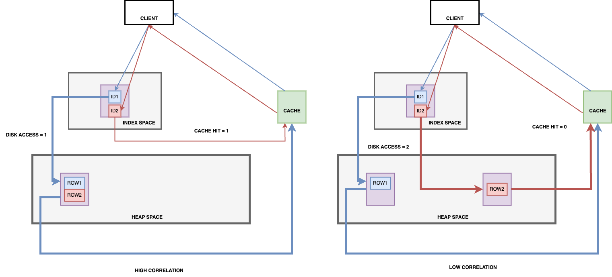

# PostgreSQL - Optimize Index Scan performance by using Cluster operation
## Introduction
When it comes to query performance, indexing is commonly referred to as magic remediation. Most of the time, leveraging the index speeds up queries significantly. However, in some scenarios, the query is still slow even index has been used. In this article, we examine the Index Scan strategy in PostgreSQL (PG) and the operator cluster to optimize further index usage.

## Pre-requisite - Some important facts
- The engine always reads data by page and not by individual row. By default, the page size is 8KB and can contain many rows.
- PG disposes of a cache that stores recently used pages. If a page is found in cache, then it is returned directly and the engine does not need to read data from the disk.

## Index Scan strategy
In PG, an index is a data structure used to efficiently retrieve records from a table based on the values of specific columns. An index contains pointers to the actual rows in the table. Pointers are organized in a specific manner to rapidly retrieve individual records. In an Index Scan operation, PG does the following actions, in order:
- PG visits the index space first and finds the relevant index tuples.
- Index tuples (pointers) contain information to locate the tuple in the heap space: the page and offset. PG uses this information to read the page and retrieve the relevant tuples. (process *)

From the description, we can gain the first insight into index scan performance. Instead of scanning the entire table, the engine only needs to find the relevant tuples from the index (and this is very fast thanks to the optimized data structure). Then the engine only visits **a few blocks** to retrieve the data.

However, things might change if the query targets an important number of rows. In this scenario, the engine repeats the previous process for each entry that satisfies the query. The second step in the process is costly. It is a random read weighted as 4 in the default PG's settings. To compare, read operators are weighted as only 1 in the Sequential Scan Strategy.

When the number of rows to retrieve is an important part of the table, the engine can switch to a Bitmap Scan or even Sequential Scan to avoid too many random reads. This condition is hard to be true on a large table. For example, for a table with 100 million rows, 1 million is only 1% of the table. The query that targets such a number of rows will be processed using Index Scan.

From the above points, we can state that on a large table, an index scan may result in poor performance for a query that targets a large amount of data if calculated in terms of the number of rows but small if calculated as a percentage compared to the table.

You might ask: but what can we do? Index Scan is still the strategy having the lowest cost in this case.
Let's see.

## Optimize Index Usage
### Correlation
> In PG, correlation measures the similarity between the logical order of index entries and the physical order of corresponding heap entries. The range of index correlation values is [-1, 1]. The value 1 means index entries and heap entries are in the same order. The value -1 means they are in inverted order. When this value is 0, there is no correlation at all between them.

Let's say we have a query that reads 2 rows from a table. In case of high correlation, adjacent tuples in index space point to adjacent tuples in heap space. In this case, the page that contains the first row may also contain the second row. Recall that recently-read pages are stored in PG's cache. The query issues only 1 access to disk for the first row. For the second row, it reads data from the cache.
In the low correlation scenario, neighbor tuples in index space point to remote tuples in heap space. As they are not on the same page, the cache can not be used in this case. The query issues access to the disk 2 times.

The following image illustrates the difference between high-correlation and low-correlation scenarios.



A more formal explanation comes from PG's source code. The number of heap pages to fetch is computed in the function `cost_index` located in `/src/backend/optimizer/path/costsize.c`. We denote: 
- T = number of pages in the table
- N = number of tuples in table
- s = selectivity = fraction of table to be scanned
- b = number of buffer pages available (we include kernel space here)

In the high correlation scenario, the number of pages to fetch is `s * T`.
In the low correlation scenario, this number of pages to fetch is computed approximately using the following function:
```C++
*	PF =
*		min(2TNs/(2T+Ns), T)            when T <= b
*		2TNs/(2T+Ns)                    when T > b and Ns <= 2Tb/(2T-b)
*		b + (Ns - 2Tb/(2T-b))*(T-b)/T	when T > b and Ns > 2Tb/(2T-b)
```

We will visualize the number of pages to fetch in high-correlation and low-correlation scenarios, using `s` as the variable. The data used in the following section come from the `imdb` dataset, you can get it [here](https://dataverse.harvard.edu/dataset.xhtml?persistentId=doi:10.7910/DVN/2QYZBT).

#### Case T <= b - Table fit in the cache.
We use the table `movie_info`. It has 161984 pages and 14838350 rows. For the cache, we use the default configuration of PG which is 524288 pages (4Gb).
```
T = 161984
N = 14838350
b = 524288
```


#### Case T > b - Table doesn't fit in the cache.
We use the same configuration as above, except the cache that is only 1Gb. 
```
T = 161984
N = 14838350
b = 131072
```


#### Discussion
- Regardless of the cache size, the number of pages to fetch in the low correlation scenario is always higher. This number also increases faster in the low correlation scenario compared to the high correlation scenario.
- When the table can be fit in the cache, the number of pages to fetch is bounded by the total pages of the table. **However, if the table is bigger than the cache, Index Scan can fetch more pages than the entire table size**. In this case, it is even worse than a seq scan operation.

### Cluster
Given the important role of **correlation** in Index Scan performance. One method to enhance Index Scan performance is `cluster`. This operation reorganizes the table rows physically according to the order of a given index, thus bringing the absolute values of `correlation` close to 1. You can read more about this operation from [PG's official document](https://www.postgresql.org/docs/current/sql-cluster.html)

Two important notes when using `cluster`:
- This will block the table: no other process can read from or write to the table. 
- The operator doesn't guarantee the order of rows inserted in the table afterward. You might think about running `cluster` regularly on low-traffic periods. 

### Experiment
We consider the following scenario: A supermarket chain stores its order information in PG. Each row represents an order with the following fields:
- `market_id`: The id of the market where the order is placed
- `order_id`: The order id
- `date`: The date when the order is placed
- `total_price`: The total price of order
- `number_items`: The number of items in the order

Each day, every supermarket in the chain sends their data of the day to the system. We can simulate the system by the following Python code:

```python
    date = start_date

    data = []
    while date <= end_date:
        for market_id in market_ids:
            for _ in range(1, nb_orders_per_day + 1):
                data.append(
                    {
                        "market_id": market_id,
                        "order_id": str(uuid4()),
                        "date": date,
                        "total_price": random.randint(100, 10000),
                        "nb_items": random.randint(1, 20),
                    }
                )

        date = date + timedelta(days=1)

    df = pd.DataFrame(data)
    load_df_to_db(df, table_name)
```
We generate data for 1000 markets for 3 years. Each market has 5 orders per day. Suppose we want to retrieve the data of a particular market for some days. For example:
```sql
SELECT * FROM orders_by_date WHERE market_id = '76418dbc-a7a2-49e8-9bd7-2a15a09e92f7' AND date >= '2024-01-01' AND date <= '2024-01-05';
```

We create an index to support the query:
```sql
CREATE INDEX orders_market_date_idx ON orders_by_date(market_id, date);
```

Running the EXPLAIN (ANALYZE, BUFFERS) for the query, we have:
```
Index Scan using orders_market_date_idx on orders_by_date  (cost=0.56..97.07 rows=23 width=94) (actual time=0.059..0.084 rows=25 loops=1)
  Index Cond: (((market_id)::text = '76418dbc-a7a2-49e8-9bd7-2a15a09e92f7'::text) AND (date >= '2024-01-01 00:00:00'::timestamp without time zone) AND (date <= '2024-01-05 00:00:00'::timestamp without time zone))
  Buffers: shared hit=11
Planning Time: 0.120 ms
Execution Time: 0.103 ms
```

We check the attribute's correlation of the table:
```
| attname     | correlation   |
|-------------|---------------|
| date        |             1 |
| market_id   | -0.0028888064 |
| order_id    |  0.0018986339 |
| nb_items    |   0.051213115 |
| total_price |  -0.009644287 |
```

We now cluster the table using the `orders_market_date_idx` index. The correlation changes:
```
| attname     | correlation   |
|-------------|---------------|
| market_id   |             1 |
| order_id    |  0.0060985703 |
| date        | -0.0036717656 |
| total_price |  0.0032424962 |
| nb_items    |   0.046741694 |
```

We analyze the same query, here is the result:
```
Index Scan using orders_clone_market_date_idx on orders_by_date_clone  (cost=0.56..52.89 rows=26 width=94) (actual time=0.055..0.062 rows=25 loops=1)
  Index Cond: (((market_id)::text = '76418dbc-a7a2-49e8-9bd7-2a15a09e92f7'::text) AND (date >= '2024-01-01 00:00:00'::timestamp without time zone) AND (date <= '2024-01-05 00:00:00'::timestamp without time zone))
  Buffers: shared hit=6
Planning Time: 0.102 ms
Execution Time: 0.081 ms
```

The number of pages to read reduced from 11 to 6. As a result, the query's total cost was reduced from 97.07 to 52.89! By reorganizing the row in the table, we reduce drastically the IO load of the query.

## Conclusion
In this article, we explore the Index Scan strategy in Postgres. When the query targets only a few rows, this strategy gives a good performance. However, when the number of records to retrieve is important, this scan method results in many random IOs which makes the query slow. We recognized the critical role of index correlation in this situation. We discover the `cluster` operation to reorganize the physical order of table rows in PostgreSQL. Finally, we conducted an experiment to demonstrate the concept.