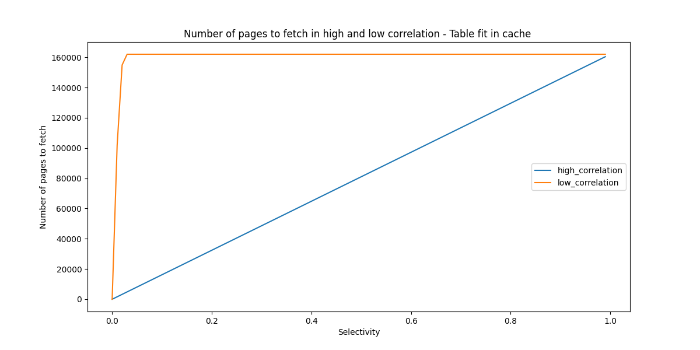
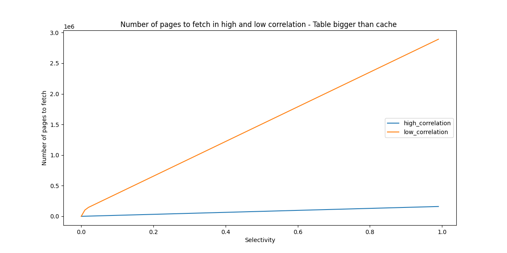

# PostgreSQL - Optimize Index Scan performance by using Cluster operation
## Introduction
When it comes to query performance, indexing are commonly referred to as the magic remediation. Most of the times, leveraging index speed up queries significantly. However, in some scenarios, the query is still slow even index has been used. In this article, we examine the Index Scan strategy in PostgreSQL (PG) and the operator cluster to optimize further index usage.

## Pre-requisite - Some important facts
- The engine always read data by page and not by individual row. By default, the page size is 8KB and can contains many rows.
- PG disposes a cache that stores recently used pages. If a page is found in cache, then it is returned directly and the engine does not need to read data from the disk.

## Index Scan strategy
In PG, an index is a data structure used to efficiently retrieve records from a table based on the values of specific columns. An index contains pointers to the actual rows in the table. Pointers are organized in a specific manner for rapidly retrieve individual record. In an Index Scan operation, PG does the following actions, in order:
- PG visits the index space first and finds the relevant index tuples.
- Index tuples (pointers) contains information to locate the tuple in the heap space: the page and offset. PG uses this information to read the page and retrieve the relevant tuples. (process *)

From the description, we can gain the first insight into index scan performance. Instead of scanning the entire table, the engine only need to find the relevant tuples from the index (and this is very fast thanks to the optimized data structure). Then the engine only visits **a few blocks** to retrieve the data.

However, if the query targets an important number of rows, things might change. In this scenario, the engine repeats the previous process for each entry satisfies the query. The second step in the process is costly. It is a random read and is weighted as 4 in the default PG's settings. To compare, in Sequential Scan Strategy, read operators is weighted as only 1.

When the number of rows to retrieve is an important part of the table, the engine can switch to a Bitmap Scan or even Sequential Scan to avoid too many random reads. This condition is hard to be true on a large table. For example, for a table with 100 millions rows, 1 millions is only 1% of the table. The query that targets such a number of rows will be processed using Index Scan.

From the above points, we can state that on a large table, index scan may result in poorly performance for a query that target a large amount of data if calculated in terms of number of rows but small if calculated as a percentage compared to the table.

You might ask: but what can we do ? Index Scan is still the strategy having lowest cost in this case.
Let's see.

## Optimize Index Usage
### Correlation
> In PG, correlation measures the similarity between the logical order of index entries and the physical order of corresponds heap entries. The range of index correlation values is [-1, 1]. The value 1 means index entries and heap entries are in the same order. The value -1 means they are in inverted order. When this value is 0, there are no correlation at all between them.

Let's say we have a query that read 2 rows from a table. In case of high correlation, adjacent tuples in index space point to adjacent tuples in heap space. In this case, the page that contains the first row may also contains the second row. Recall that recently read pages are stored in PG's cache. The query issues only 1 access to disk for the first row. For the second row, it reads data from the cache.

The following image illustrate the different between high correlation and low correlation scenario.
@TODO: add image

A more formal explanation come from PG's source code. The number of heap pages to fetch is computed in the function `cost_index` located in `/src/backend/optimizer/path/costsize.c`. We denote: 
- T = number of pages in table
- N = number of tuples in table
- s = selectivity = fraction of table to be scanned
- b = number of buffer pages available (we include kernel space here)

In the high correlation scenario, the number of pages to fetch is `s * T`.
In the low correlation scenario, this number of pages to fetch is computed approximately using the following function:
```C++
*	PF =
*		min(2TNs/(2T+Ns), T)            when T <= b
*		2TNs/(2T+Ns)                    when T > b and Ns <= 2Tb/(2T-b)
*		b + (Ns - 2Tb/(2T-b))*(T-b)/T	when T > b and Ns > 2Tb/(2T-b)
```

We will visualize the number of pages to fetch in high correlation and low correlation scenario, using `s` as variable. The data used in the following section come from the `imdb` dataset, you can get it [here](https://dataverse.harvard.edu/dataset.xhtml?persistentId=doi:10.7910/DVN/2QYZBT).

#### Case T <= b - Table fit in cache.
We use the table `movie_info`. It has 161984 pages, 14838350 rows. For the cache, we use the default configuration of PG which is 524288 pages (4Gb).
```
T = 161984
N = 14838350
b = 524288
```



#### Case T > b - Table doesn't fit in cache.
We use the same configuration as above, except the cache that is only 1Gb. 
```
T = 161984
N = 14838350
b = 131072
```



#### Discussion
- Regardless of the cache size, the number of pages to fetch in the low correlation scenario is always higher. This number also increases faster in the low correlation scenario compared to the high correlation scenario.
- When the table can be fit in the cache, the number of pages to fetch is bounded by the total pages of the table. **However, if the table is bigger than the cache, Index Scan can fetch more pages than the entire table size**. In this case, it is even worst than a seq scan operation.

### Cluster
Given the important role of **correlation** in Index Scan performance. One method to enhance Index Scan performance is `cluster`. This operation reorganizes the table rows physically according to the order of a given index, thus bring the absolute values of `correlation` close to 1. You can read more about this operation from [PG's official document](https://www.postgresql.org/docs/current/sql-cluster.html)

Two important notes when using `cluster`:
- This will block the table: no other process can read from or write to the table. 
- The operator doesn't guarantee the order of rows inserted in the table afterwards. You might think about running `cluster` regularly on low-traffic period. 

### Experiment
@TODO

## Conclusion
In this article, we explore the Index Scan strategy in Postgres. When the query targets only a few rows, this strategy give the good performance. However, when the number of records to retrieve is important, this scan method results in many random IO which makes the query slow. We recognized the critical role of index correlation in this situation. We discover the `cluster` operation to reorganize the physical order of table rows in PostgreSQL. Finally, we conducted an experiment to demonstrate the concept.