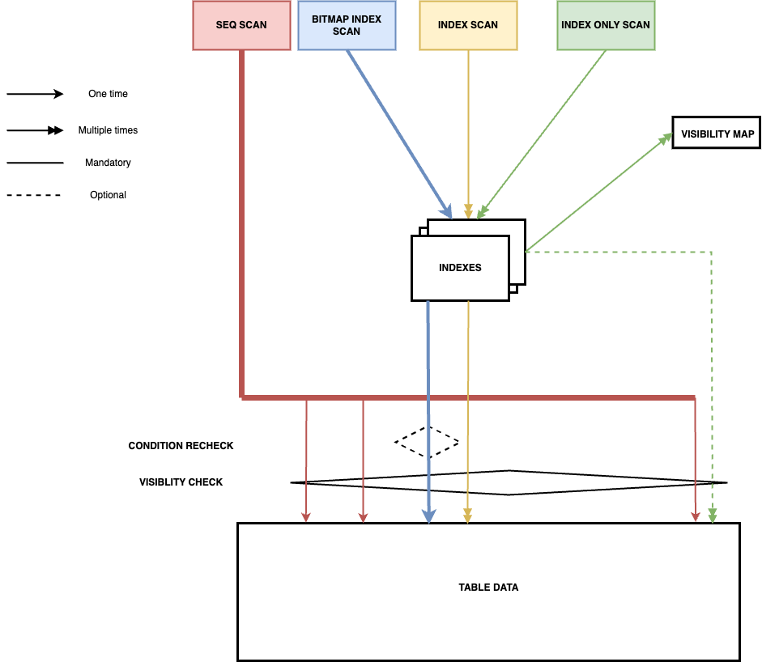

# Learning note: PostgresSQL Scan Types

## Purpose
The purpose of this note is to explain what PostgresSQL does behind the scenes for each type of scan. This allows us to better understand the execution plan and determine whether it is good or not.

## Prerequisites
### Multi Version Concurrency Control
Postgres allow many transactions to run concurrently. Concurrent transactions can be isolated in different levels.

When the isolation level is Repeatable Read, SELECT queries inside a transaction always see the same data. If another transaction commits its changes between 2 select queries, the 2nd select doesn't see the modification <sup>1</sup>. To support this isolation level, PG allows queries to see a snapshot of the database at a specific point in time, regardless of the current state.

  
When a row is updated, it is not updated in place. Instead:
  - A new version of the row will be created
  - The modification is applied on that version
  
Each row contains information about insertion time, deletion time... These information are used to determine if a row is visible for the transaction.

## PostgresSQL Scan Types in detail
### Seq Scan
PostgresSQL visits the table data, **row by row**. PG gets rows that satisfy the query and are visible for the current transaction <sup>2</sup>.
  
### Index Scan
Index contains **pointers** to the actual rows in the table. Pointers are organized in tree structure for efficient access.

In Index Scan, PostgresSQL visits the index first. **Each time a match found, PG visits the table data to get the row** <sup>3</sup>.
  - PG contains one entry in index per *row version*. **A row might have many entries in index that point to it <sup>4</sup>.** 
  - When accessing table data, PostgresSQL checks if the row is visible for the current query.

### Bitmap Index Scan & Bitmap Heap Scan
PostgresSQL visits the index first and **only once** to get all relevant index entries. It then builds a bitmap contains all matches.
  - Multiple bitmaps can be builded in 1 query by different indexes. Bitmap are mixed using AND, OR... operator.
  - Due to a relatively high number of rows to retrieve, bitmap items are sorted by row's physical location to optimize data access. However, the index order is lost which causes a negative impact on the ORDER BY clause <sup>5</sup>. 
  - There are two types: **exact heap and lossy heap**.
    - Exact heap: direct pointer to the row
    - Lossy heap: pointer to the page containing the row. When the row-based bitmap is too large to fit in the memory

PostgresSQL uses the index bitmap to access table data **in batch**.
  - Exact heap: PG does not need to recheck the condition for each row
  - Lossy heap: PostgreSQL needs to re-check the index condition for each row to ensure it still matches the query criteria.

In both cases, PostgreSQL checks if the row is visible for the current transaction, just like it would for a sequential scan or index scan.


### Index Only Scan
PostgresSQL visits the index to get rows that satisfy the condition. For each index entry that matches the condition, PG checks if the row is visible for the current query. If it is the case, the rows is qualified without table access. 

Visibility information is not stored in index data but only in table data and the Visibility Map.

- First, PostgresSQL uses the Visibility Map
  - Visibility Map contains, for each page, 2 bits:
      - ALL_VISIBLE: all rows in the page are visible for current & future transactions
      - ALL_FROZEN: all rows in the page are obsolete for current & future transactions
  - If ALL_VISIBLE bit is set, then the entry is returned without addition work. There is no table access in this case.
  - If ALL_VISIBLE bit is not set. A table access is required to check the row's visibility.
  
[Postgres document](https://www.postgresql.org/docs/current/indexes-index-only-scans.html)

### Schema
We can resume the description of each index scan types in this schema



### How PostgresSQL chooses a scan type
Index Only Scan operation can only be used when all the selected columns are included in the index. For other scan operations, PostgresSQL evaluates the execution cost and picks the most efficient way.

PostgresSQL models the cost of data access and processing using a [set of parameters](https://www.postgresql.org/docs/current/runtime-config-query.html#RUNTIME-CONFIG-QUERY-CONSTANTS). In its most basic form, we can apply the following rule of thumb:
- If the query select only a few rows in the table, Index Scan is the most optimized method.
- If the query select a fraction of a table, Bitmap Scan Index will be used.
- If the query select most of the table's rows, Seq Scan will be used.

## Experimentation
This section includes a reproducible experiment that shows how PostgresSQL uses different strategies to find records in a table.

### Get the dataset
- Go to this [link](https://dataverse.harvard.edu/dataset.xhtml?persistentId=doi:10.7910/DVN/2QYZBT) and download the file imdb_pg11. Rename the file to `dataset`
- Open your terminal and run `pg_restore -d imdb dataset`

### The table used for testing 
We use the table `aka_name` for the experimentation.

#### Definition and Index
```sql
-- Table Definition
CREATE TABLE "public"."aka_name" (
    "id" int4 NOT NULL,
    "person_id" int4 NOT NULL,
    "name" varchar,
    "imdb_index" varchar,
    "name_pcode_cf" varchar,
    "name_pcode_nf" varchar,
    "surname_pcode" varchar,
    "md5sum" varchar,
    PRIMARY KEY ("id")
);

-- Index
CREATE INDEX person_id_aka_name ON aka_name USING BTREE (person_id);
```

#### Statistics
As we'll explore how PostgresSQL uses index, we get the number of rows and distinct `person_id` values in the table
```sql
SELECT
    count(*) nb_rows,
    count(DISTINCT (person_id)) nb_distinct_person_id
FROM
    aka_name
```

| nb_rows | nb_distinct_person_id |
|---------|----------------------|
|  901343 |               588222 |

There are many distinct values of `person_id` in the table. Because of that, we'll expect a query with `WHERE person_id = ...` target just a few rows and thus it will use the Index Scan type.

When we increase the number of target rows progressively, we expect that at some point, PostgresSQL will switch to Bitmap Index Scan and then Seq Scan.
Finally, we expect that Index Only Scan will be used when we select the column `person_id`, if the number of targeted rows is very low.

### Run test

**Query 1**
```sql
EXPLAIN (ANALYZE) SELECT * FROM aka_name WHERE person_id = 1
```
**Plan**
```
Index Scan using person_id_aka_name on aka_name  (cost=0.42..12.45 rows=2 width=87) (actual time=0.024..0.025 rows=0 loops=1)
  Index Cond: (person_id = 1)
Planning Time: 0.111 ms
Execution Time: 0.048 ms
```
-------

**Query 2**
```sql
EXPLAIN (ANALYZE) SELECT * FROM aka_name WHERE person_id < 26
```
**Plan**
```
Bitmap Heap Scan on aka_name  (cost=4.46..24.21 rows=5 width=87) (actual time=0.015..0.019 rows=6 loops=1)
  Recheck Cond: (person_id < 26)
  Heap Blocks: exact=2
  ->  Bitmap Index Scan on person_id_aka_name  (cost=0.00..4.46 rows=5 width=0) (actual time=0.007..0.007 rows=6 loops=1)
        Index Cond: (person_id < 26)
Planning Time: 0.153 ms
Execution Time: 0.043 ms
```
-------

**Query 3**
```sql
EXPLAIN (ANALYZE) SELECT * FROM aka_name WHERE person_id < 1650000
```
**Plan**
```
Bitmap Heap Scan on aka_name  (cost=6233.25..22178.96 rows=363977 width=87) (actual time=63.428..212.371 rows=365286 loops=1)
  Recheck Cond: (person_id < 1650000)
  Heap Blocks: exact=10815
  ->  Bitmap Index Scan on person_id_aka_name  (cost=0.00..6142.25 rows=363977 width=0) (actual time=61.226..61.227 rows=365286 loops=1)
        Index Cond: (person_id < 1650000)
Planning Time: 0.104 ms
Execution Time: 222.665 ms
```
-------

**Query 4**
```sql
EXPLAIN (ANALYZE) SELECT * FROM aka_name WHERE person_id < 1700000
```
**Plan**
```
Seq Scan on aka_name  (cost=0.00..22662.79 rows=375897 width=87) (actual time=0.022..59.943 rows=376816 loops=1)
  Filter: (person_id < 1700000)
  Rows Removed by Filter: 524527
Planning Time: 0.132 ms
Execution Time: 70.504 ms
```
-------

**Query 5**
```sql
EXPLAIN (ANALYZE) SELECT * FROM aka_name WHERE person_id < 25
```
**Plan**
```
Index Only Scan using person_id_aka_name on aka_name  (cost=0.42..4.50 rows=4 width=4) (actual time=0.004..0.006 rows=6 loops=1)
  Index Cond: (person_id < 25)
  Heap Fetches: 0
Planning Time: 0.110 ms
Execution Time: 0.021 ms
```

## Reference
[1] Postgres official document: https://www.postgresql.org/docs/current/transaction-iso.html#XACT-REPEATABLE-READ:~:text=a%20query%20in%20a%20repeatable%20read%20transaction%20sees%20a%20snapshot%20as%20of%20the%20start%20of%20the%20first%20non%2Dtransaction%2Dcontrol%20statement%20in%20the%20transaction%2C%20not%20as%20of%20the%20start%20of%20the%20current%20statement%20within%20the%20transaction.%20Thus%2C%20successive%20SELECT%20commands%20within%20a%20single%20transaction%20see%20the%20same%20data

[2] Blog PostgresPro: https://postgrespro.com/blog/pgsql/5969403#:~:text=.%20On%20each%20page%2C%20the%20system%20checks%20the%20visibility%20of%20each%20row%20version


[3] Postgres QA: https://www.postgresql.org/message-id/12553.1135634231@sss.pgh.pa.us#:~:text=A%20plain%20indexscan%20fetches%20one%20tuple%2Dpointer%20at%20a%20time%20from%20the%20index%2C%0Aand%20immediately%20visits%20that%20tuple%20in%20the%20table

[4] Postgres official document: https://www.postgresql.org/docs/8.1/indexam.html#:~:text=An%20index%20is,own%20index%20entry

[5] Postgres QA: https://www.postgresql.org/message-id/12553.1135634231@sss.pgh.pa.us#:~:text=A%20bitmap%20scan,said%20ORDER%20BY.