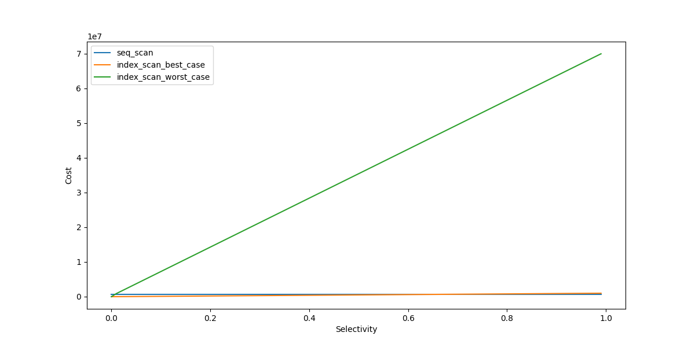

# Introduction
When it comes to query performance, indexes are commonly referred to as the magic remediation. In most cases, indexes speed up queries significantly. But why?
In this article, we will look at the Index Scan operation in Postgres.
- Explain why the index is fast in certain situations
- The scenario in which index doesn't perform as good as we imagine

This article only examine BTREE indexes.

# Sequential Scan & Index Scan
To understand why index scan is fast, we use Sequential Scan operation as the baseline. Sequential Scan operation is the default option of Postgres when faster scan modes aren't applicable.

## First insight
First, we examine the procedure of Sequential Scan and Index Scan operation.

- In a sequential Scan operation, PG visits the heap space. It reads all the table data, page by page. Then it checks every tuple if it matches the filter condition and is visible for the query.
- In an Index Scan operation, PG does the following actions, in order:
  - PG visits the index space first and finds the relevant index tuples.
  - Index tuples are pointers to heap tuples. It contains information to locate the tuple in the heap space: the page and offset. PG uses this information to read the page and retrieve the relevant tuples.

By comparing these two procedures, we can gain the first insight into index scan performance. PG identifies the data it need using index. Then it only visits a few blocks instead of the whole table.

However, this is a qualitative statement. What if the number of blocks identified by index is important?

We would like to compare the speed of Sequential scan and Index Scan using a quantitative analysis. Such comparison is really challenging given the variety of parameters and hardware options. PG has a sophisticated mechanism to evaluate the cost of an execution plan. Although the system is not an exact representation of reality, it "should be" a reliable source to measure the performance of each scan type.

## Quantitative analysis

### Postgres cost constants
In PG, the term of `cost` refers to a number in an arbitrary unit, that indicates how heavy the operation is. The costs of basic operations in PG are given below:

**seq_page_cost**: Cost to fetch a page from disk in a series. Default value is 1.0.

**random_page_cost**: Cost to fetch a page from disk randomly. Default value is 4.0.

**cpu_tuple_cost**: Cost to process a data entry. Default value is 0.01.

**cpu_index_tuple_cost**: Cost to process an index entry. Default value is 0.005.

**cpu_operator_cost**: Cost of execute an operator in a query. Default value is 0.0025.

Our goal is to have a visualization of each scan type cost. To avoid too many case figures in the calculation, we assume the following:
- The index is a fully one, not partial
- The query doesn't contain operators that lead to a loop. Example: IN, = ANY(ARRAY()), JOIN
We consider these situations in the end to generalize the result.

In the following calculation, we use:
- T refers to the number of pages in the table
- N refers to the number of tuples in the table
- t refers to the number of pages in the index
- n refers to the number of tuples in the index
- b refers to the number of pages in the cache (both Postgres and OS)
- k1 refers to the number of conditions in the query
- k2 refers to the number of conditions used by the index.

### Sequential Scan cost

Based on the function `cost_seqscan` in `/postgres/src/backend/optimizer/path/costsize.c`, we can compute the cost of sequential scan like following: 

Sequential scan cost consists of CPU cost and IO cost:
$$sequential\\_scan\\_cost = seq\\_cpu\\_cost + seq\\_IO\\_cost$$

For CPU, PG check all the tuples against the conditions, plus the cost to process a data entry:
$$seq\\_cpu\\_cost = (cpu\\_tuple\\_cost + k_1 * cpu\\_operator\\_cost) * n\\_tuples = (0.01 + 0.0025 * k_1) * N$$

For IO, PG must visit all the pages. Heap pages read are sequential:
$$seq\\_IO\\_cost = seq\\_page\\_cost * n\\_pages = T$$

The total cost of a sequential scan operation is:
$$sequential\\_scan\\_cost = (0.01 + 0.0025 * k_1) * N + T$$

### Index Scan cost

In an index scan, there are 2 steps: visit the index space and the heap space:
$$index\\_scan\\_cost = index\\_cost + heap\\_cost$$

Each stage has it own cpu cost and IO cost:
$$index\\_cost = index\\_cpu\\_cost + index\\_IO\\_cost$$
$$heap\\_cost = heap\\_cpu\\_cost + heap\\_IO\\_cost$$

#### Index cost
The index space visiting cost using BTREE  is computed by 2 functions `genericcostestimate` and `btcostestimate` located in `/src/backend/utils/adt/selfuncs.c` file.


> **Selectivity**
>
> In Index Scan, **indexSelectivity** refers to the ratio of the number of table entries that satisfy the filter conditions on the total number of table entries. Let's call it `s`.
>
> We have:
>
> $$n\\_tuples\\_fetched = s * n\\_tuples = s * N$$
>
> "For a btree scan, only leading '=' quals plus inequality quals for the immediately next attribute contribute to index selectivity". So **btreeSelectivity** is greater than or equal to **indexSelectivity**. We use `bs` to refers to the btreeSelectivity. We have:
> 
> $$n\\_index\\_tuples\\_read =  bs * n\\_index\\_tuples = bs * n$$ 
> 
> and:
> 
> $$ n\\_index\\_pages\\_fetched = bs * n\\_index\\_pages = bs * t$$


Index CPU cost consists of the cost to traverse the tree to find relevant index tuples and the cost to process those tuples:
$$index\\_cpu\\_cost = tree\\_traversal\\_cost + (cpu\\_index\\_tuple\\_cost + k_2 * cpu\\_operator\\_cost) * n\\_index\\_tuples\\_read$$ 

With:
$$tree\\_traversal\\_cost = ceil(log(n\\_index\\_tuples)/log(2)) * cpu\\_operator\\_cost + 50 * cpu\\_operator\\_cost * (tree\\_height + 1)$$ 

So:
$$index\\_cpu\\_cost = ceil(log(n)/log(2)) * 0.0025 + 0.125 * (tree\\_height + 1) + (0.005 + k_2 * 0.0025) * bs * n$$

As the goal is not to compute the exact value of index cost, but rather to see its evolution, we can remove `log(n)`, `tree_height` and constants from the formula. They tend to be minor compare to  `(0.005 + k_2 * 0.0025) * bs * n` when `n` is large.

When it comes to IO, index pages are read randomly: 
$$index\\_IO\\_cost = random\\_page\\_cost * n\\_index\\_pages\\_fetched = 4 * bs * t$$

We have the `index_cost` formula as following:
$$index\\_cost = (0.005 + k_2 * 0.0025) * bs * n + 4 *  bs * t$$

Because `bs >= s`, we can replace `bs = s + c`:

$$index\\_cost = (0.005 + k_2 * 0.0025) * (s + c) * n + 4 * (s + c) * t = (0.005 + k_2 * 0.0025) * s * n + 4 * s * t + C$$

We can remove constant from the formula:
$$index\\_cost = (0.005 + k_2 * 0.0025) * s * n + 4 * s * t$$

#### Table cost
The table space visiting cost is computed in the function `cost_index` located in `/src/backend/optimizer/path/costsize.c`.

Table CPU cost related to the cost to process a data entry and the cost to check conditions. PG only performs check on conditions that haven't been verified by the index.

$$table\\_cpu\\_cost =  (cpu\\_tuple\\_cost + (k_1 - k_2) * cpu\\_operator\\_cost) * n\\_tuples\\_fetched$$

As mentioned previously:
$$n\\_tuples\\_fetched = s * N$$

We have:
$$table\\_cpu\\_cost = (0.01 +  (k_1 - k_2) * 0.0025) * s * N$$


Table IO cost depends on the number of pages we need to retrieve from PG. This number is computed in `index_pages_fetched` function located in `/src/backend/optimizer/path/costsize.c`. It depends on a new factor: `Index Correlation`

> **Index Correlation**
>
>It indicates the similarity between the logical order of index entries and the physical order of corresponds heap entries. The range of index correlation values is [-1, 1]. The value 1 means index entries and heap entries are in the same order. The value -1 means they are in inverted order. When this value is 0, there are no correlation at all between them. In the calculation, we use `C` to refer to Index Correlation.

There are 3 situations:
- Best case (C = 1 or C = -1)
- Worst case (C = 0)
- Normal cases (C is between -1 and 1 but not equals to 0).

**Best case**

In case of high correlation, the order of index entries and heap entries totally match. The number of heap pages to read is the fraction of the table identified by Selectivity.  In addition, the first heap visit is random, but all subsequent reads are sequential.

$$table\\_IO\\_cost\\_best\\_case = random\\_page\\_cost + seq\\_page\\_cost * (s * n\\_pages - 1)$$

Like above, we can remove constants from the formula, we have:
$$table\\_IO\\_cost\\_best\\_case = s * T$$

**Worst case**

In case of low correlation, PG use an approximation of number page to fetch

```C++
 * We use an approximation proposed by Mackert and Lohman, "Index Scans
 * Using a Finite LRU Buffer: A Validated I/O Model", ACM Transactions
 * on Database Systems, Vol. 14, No. 3, September 1989, Pages 401-424.
 * The Mackert and Lohman approximation is that the number of pages
 * fetched is
 *	PF =
    *		min(2TNs/(2T+Ns), T)			when T <= b
    *		2TNs/(2T+Ns)					when T > b and Ns <= 2Tb/(2T-b)
    *		b + (Ns - 2Tb/(2T-b))*(T-b)/T	when T > b and Ns > 2Tb/(2T-b)
    * where
    *		T = # pages in table
    *		N = # tuples in table
    *		s = selectivity = fraction of table to be scanned
    *		b = # buffer pages available (we include kernel space here)
```

- when T <= b
$$table\\_IO\\_cost\\_worst\\_case = 4 * PF  = 4 * min(2TNs/(2T+Ns), T)$$

- when T > b and Ns <= 2Tb/(2T-b)
$$table\\_IO\\_cost\\_worst\\_case = 4 * PF  = 8TNs/(2T+Ns)$$

- when T > b and Ns > 2Tb/(2T-b)
$$table\\_IO\\_cost\\_worst\\_case = 4(b + (Ns - 2Tb/(2T-b))*(T-b)/T)$$

For other cases, the cost is computed as pro-rate between the worst and the best case using C<sup>2</sup>.

$$table\\_IO_cost\\ = table\\_IO\\_cost\\_worst\\_case + C^2(table\\_IO\\_cost\\_best\\_case - table\\_IO\\_cost\\_worst\\_case)$$


### Visualization
The cost of index size depends on many parameters. We consider some scenarios where T, N, b, t, n, k1 and k2 are constants. We draw a graph that illustrates the relation between the scan cost and `s`:

#### Scenario 1: The table size is smaller than the cache size (T <= b)

**Configuration 1**: From table with 10950049 rows. Each row contains 2 varchar columns, 1 timestamp column and 2 integer columns. The index is on the varchar column and is unique. The effective cache size is 4Gb. The query contains 2 conditions and 1 of them is on the index.

```
T = 179509
N = 10950049
b = 524288
t = 102924
n = 10950049
k1 = 2
k2 = 1
```


**Configuration 2**: From table with 36233108 rows. Each row contains 6 integer columns and 1 varchar column. The index is on the integer column and is not unique. The effective cache size is 4Gb. The query contains 1 condition it is on the index.

```
T = 252687
N = 36233108
b = 524288
t = 30663
n = 36233108
k1 = 1
k2 = 1
```


The pattern is quite the same.

#### Scenario 2: The table size is bigger than the cache size (T > b)

**Configuration 1**: Same as the configuration 1 of the previous scenario. We reduced the effective cache size to only 1Gb.

```
T = 179509
N = 10950049
b = 131072
t = 102924
n = 10950049
k1 = 2
k2 = 1
```


**Configuration 2**: Same as the configuration 2 of the previous scenario. We reduced the effective cache size to only 1Gb.

```
T = 252687
N = 36233108
b = 131072
t = 30663
n = 36233108
k1 = 1
k2 = 1
```



#### Discussion
- Index cost is smaller than sequential cost when s is near 0: **index improve performance when it determines only a few row.**
- Regardless of the cache size available, the difference between the worst and the best index cost is significant when s increases. When retrieve a relatively high number of rows from the table, index correlation has a big impact on the whole index scan process.
- In the worst case, the index cost increases extremely fast when s increases. The query only need to targets more than about 2% number of rows in the table to be more expensive than a full table scan.

## Conclusion
