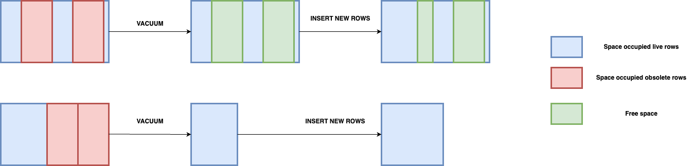

# Learning note: VACUUM and REINDEX

## Introduction
As shown in [Multi Version Concurrency Control](../index/index_scan.md#multi-version-concurrency-control), PostgresSQL doesn't deleted physically the row but just marked it invisible for future transactions. There are several downsides of this approach:

1. Overtime, dead rows cumulate and occupy a non negligible part in the disk. This is true for both heap space and index space.

2. Dead tuples slow down queries. 
- For sequential scan, PG must scan all tuples, including dead ones.
- For index scan, the time to traverse the index tree is longer. In addition, PG might encounter index tuples pointing to dead rows. It this case, PG does some/many heap fetches unnecessarily 1.

Therefore, **clean up the database regularly is required to have a stable performance. If you're charging by disk consumption, this can also help you to save money**. PostgresSQL provides some commands allow to clean up the heap space and index space. In this note, we will examine 2 commands: `VACUUM` and `REINDEX`.

## VACUUM
In the most basic form, VACUUM command removes obsolete rows of a table. The space previously occupied by obsolete rows is now free and can be reused by the same table.

It's important to know that in most cases, **the free space claimed by normal VACUUM process is not returned to the OS**. The table size remains the same after running VACUUM commands. 
The exception is when all obsolete rows are **at the end of the table**, Postgres truncate off any empty pages occupied by those rows and return disk space to the OS.

We can verify the statement above by doing the following experimentation:
- Create a table
- Disable AUTOVACUUM mode for the table
- Insert 100000 rows
- Capture the heap size of the table
- Delete 50000 rows
- Capture the heap size of the table
- Run the VACUUM command
- Capture the heap size of the table
- Insert 50000 rows
- Capture the heap size of the table
- Insert 10000 rows
- Capture the heap size of the table

I ran the experimentation in 2 scenarios: delete rows in the middle of the table and at the end of the table. 

In both scenarios, the table's size did not change after the `DELETE` command. As deleted rows still present physically in the disk.

In the scenario of deleting rows in the middle of the table: 
  - The table's size did not change after the `VACUUM` command. As vacuum process doesn't return free space to the OS.
  - The table's size did not change after the `INSERT` command. As new rows will be stored in free space claimed by vacuum process.
  
In the scenario of deleting rows at the end of the table:
  - The table's size decreased after the `VACUUM` command. As VACUUM command truncated empty pages at the end of the table and return disk space to the OS.
  - Consequently, the table's size increased after the `INSERT` command. PostgresSQL needs additional space to store new rows.

Finally, in both cases, the table's size increased after the second `INSERT` command. Because there are no space to reuse, Postgres needs additional space for new rows.

The following schema illustrate the effect of VACUUM commands on the heap space:

### Effect of VACUUM command on the index space
VACUUM command performs the clean up process not only on the heap space, but also on the index space. By default, PostgresSQL checks if there are many dead index tuples or not and run the process accordingly. We can  force PostgresSQL to clean up index space by setting the parameter `INDEX_CLEANUP` to `ON`.

We can observe the effect of VACUUM command on the index space by the following experimentation: 
- Create a table
- Disable AUTOVACUUM mode for the table
- Insert 100000 rows
- Create an index on the table
- Capture the index size of the table
- Delete 50000 rows of the table
- Capture the index size of the table
- Run the VACUUM command with `INDEX_CLEANUP` is `ON`
- Capture the index size of the table
- Insert 50000 rows
- Capture the index size of the table

I ran the experimentation in 2 scenarios: reinsert the data previously deleted and insert new data to the table.

In both scenarios, the index size did not change after the `DELETE` command. As said earlier, dead tuples still present in the index space.

In both scenarios, the index size did not change after the `VACUUM` command. Vacuum process removes dead tuples but does not compact index space into smaller size.

In both scenarios, the index size increased after inserting data to the table.
> <u>Question zone</u>
> 1. When reinserting the previously deleted data into the table, the index size increased **more** than inserting new data. WHY? Does PostgresSQL reuse free space to store new tuples in index space like it does with heap space?

### AUTO VACUUM
Vacuum regularly is important for production databases. Therefore, PostgresSQL provides the capability to automatically run vacuum process if some conditions are met. There are some parameters that determine when the vacuum process should be triggered.

#### autovacuum (boolean, default TRUE)
#### autovacuum_vacuum_threshold (integer, default 50)
The minimum number of updated or deleted tuples needed to trigger a VACUUM on a table.
#### autovacuum_vacuum_scale_factor (float, default 0.2)
A fraction of the table to add to `autovacuum_vacuum_threshold` when deciding whether to trigger a VACUUM

The threshold is defined as follow:
$$Threshold = autovacuum\\_vacuum\\_threshold + autovacuum\\_vacuum\\_scale\\_factor * number\\_live\\_tuples$$

We can interpret the formula as following:

> The VACUUM process is automatically triggered if 2 conditions below are true:
> - When dead tuples represent more than `autovacuum_vacuum_scale_factor` of live tuples
> - It is greater than the `autovacuum_vacuum_threshold`
>
> The second condition is useful to avoid triggering AUTOVACUUM on small tables.

AUTOVACUUM can also be triggered when the number of inserted rows exceeds a limit. PostgresSQL use 2 parameters: `autovacuum_vacuum_insert_threshold` and `autovacuum_vacuum_insert_scale_factor` to decide if it should trigger a VACUUM. These 2 parameters work in the same mechanism as explained above.

## REINDEX
As VACUUM command does not compact the index space, **the index size increases overtime**. The impact is more severe on frequently UPDATE/DELETE table. If we're using cloud service that bills on disk space consumption, **we pay a lot more than what we actually use**.

To reduce the size of index, we can run the `REINDEX` command. This command recreate the entire index, thus dead tuples don't occupy the space anymore. During the process, the old and new index coexist. When the new index is ready to be used, PostgresSQL removes the old one.

We can observe the effect of REINDEX command by the following experimentation:
- Create a table
- Insert 100000 rows
- Create an index on the table
- Capture the index size of the table
- Delete 50000 rows of the table
- Capture the index size of the table
- Run the REINDEX command
- Capture the index size of the table

The index size is reduced after running `REINDEX` command. 

> <u>Question zone </u>
>
> In the test, I reinsert the previously deleted data. The index size is greater than it was before deleting data. The delta is even greater than when using `VACUUM` command with `INDEX_CLEANUP`. WHY?

[1] In fact, Postgres implemented an optimization for this situation. When visiting a heap tuple, if PG discover that the tuple is obsolete, it will mark the corresponding index tuple as obsolete as well. So in subsequent queries, PG doesn't need to revisit the heap tuple. [Reference](https://www.cybertec-postgresql.com/en/killed-index-tuples/)